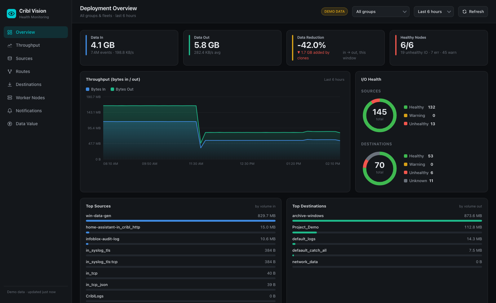

# Vitals

**Health monitoring for Cribl deployments.**



## Install

Grab the app archive from the [latest release](https://github.com/VisiCore/CC-VisiCore-Vitals/releases/latest),
then in Cribl go to **Manage → App Platform → Add App → Import from File** and upload the
`.tgz`. Alternatively, use **Import from URL** with the release asset link directly:

```
https://github.com/VisiCore/CC-VisiCore-Vitals/releases/download/v1.2.2/cc-visicore-vitals-1.2.2.tgz
```

Once installed and shared, the app runs on live data automatically — no configuration needed.

A Cribl App Platform app that gives Stream administrators a single, real‑time view of
deployment health. Where the original [CriblVision Pack](https://packs.cribl.io/packs/cribl-criblvision-for-stream)
re‑implemented the same dashboards three times (Cribl Search / Splunk / Grafana), this
is one self‑contained web app that talks directly to the Cribl REST API — no Search
executions, no external backend.

## Dashboards

| Page | What it shows |
|---|---|
| **Overview** | KPI tiles (data in/out, reduction, healthy nodes), live throughput chart, Source/Destination health donuts, top sources / destinations / routes, node table |
| **Throughput** | Bytes/events in‑out time series (toggle), dropped‑events trend, per‑group volume & reduction table |
| **Sources** | Every Source with live health, type, volume in, events, **persistent-queue depth, and backpressure state** — searchable, filterable by health, sortable, expandable to status detail + related error notifications + a deep link into Cribl Stream |
| **Routes** | **Route Health**: routes that reported data in the window but have gone silent past a configurable stall threshold — stalled-first sorting, silent-for durations, and a deep link to the group's routing table |
| **Pipelines** | Per-pipeline events in/out, **dropped counts, drop %, and processing errors**, with a Top Droppers panel — spot the pipeline silently eating your events |
| **Destinations** | Every Destination with health, volume out, **dropped** counts, **persistent-queue depth, and backpressure state** (engaged now / earlier in window) — expandable to status detail + related errors + a deep link into Cribl Stream |
| **Collectors** | Collection & scheduled job runs across groups — state, **failed-task counts**, cron schedules, events/bytes collected, filterable to failures and in-flight runs, **expandable to the actual task errors** (message + stack trace) |
| **Worker Nodes** | Worker & edge fleet health matrix — **CPU & memory trend sparklines per node**, disk, worker processes, last heartbeat, leader vitals, and a **Config & Version Drift** panel (committed config version, mixed-version and behind-leader detection per group) |
| **Alerts** | **Email alerting** — create native Cribl Notifications (destination unhealthy / backpressure / PQ usage, source no-data / volume thresholds) delivered through the platform SMTP target; Cribl evaluates conditions server-side, so alerts fire even with the dashboard closed |
| **Notifications** | System errors / warnings / info (failed source inits, zero-volume routes) — filterable, searchable, expandable to full detail |
| **Data Value** | Ingest vs delivery ROI: reduction %, estimated savings at your $/GB, monthly/annual projections, 45‑day daily trend, and **License Headroom** — daily ingest trended against the licensed quota with a days‑to‑quota projection |

A global **group** selector (all groups / any stream group / edge fleet), a **time‑range**
selector (1h · 6h · 24h · 7d), and 30‑second auto‑refresh apply across every page.
Selections (group, range, stall threshold, $/GB rate) persist in the app's scoped KV
store (localStorage in demo mode).

## How it works

The app runs sandboxed inside Cribl and uses the platform fetch proxy — it never handles
auth tokens. All access is declared in `config/policies.yml`; monitoring calls are
read‑only, and the only writes are the Notification CRUD behind the Alerts page:

- `POST /system/metrics/query` — throughput / dropped / route / pipeline / persistent‑queue / backpressure metrics
- `GET /master/workers`, `/master/groups` — node & group inventory (incl. committed config versions)
- `GET /w/:wid/system/metrics` — per‑node CPU / memory history (sparklines)
- `GET /m/:gid/system/inputs|outputs` — per‑group Source/Destination config + authoritative health
- `GET /m/:gid/jobs` — collection & scheduled job runs (states, failed tasks, cron)
- `GET /notification-targets` — SMTP target inventory & delivery stats for the Alerts page
- `GET|POST|PATCH|DELETE /m/:gid/notifications` — the native Cribl Notifications that power email alerts
- `GET /system/messages` — system notifications (errors / warnings / info)
- `GET /system/info`, `/system/licenses/usage`, `/system/licenses` — leader vitals, daily usage & quota
- App‑scoped KV store (`/kvstore/vision/prefs`) — persisted UI preferences

When run standalone (`npm run dev`, no Cribl host) it falls back to captured demo
fixtures in `public/fixtures.json`, so the full UI is viewable without a live leader — a
**DEMO DATA** badge is shown in that mode.

## Develop

```bash
npm install
npm run dev        # standalone dev server with demo fixtures
npm run build      # type-check + production build
npm run lint       # oxlint
npm run package    # build + create the installable app archive (bumps version)
```

Install the resulting archive from **Cribl → Manage → App Platform**. Once installed,
`window.CRIBL_API_URL` is present and the app switches to live data automatically.

## Structure

```
src/
  api/        client.ts (live + fixture data layer), types.ts
  state/      AppContext.tsx (group / range / refresh)
  hooks/      useAsync.ts (polling fetch)
  lib/        format.ts, metrics.ts, routeHealth.ts, prefs.ts
  components/ Layout, ui primitives, charts/ (TimeSeriesChart, HealthDonut, Sparkline)
  pages/      Overview, Throughput, Sources, RouteHealth, Pipelines, Destinations,
              Jobs, Alerts, Nodes, Notifications, DataValue
config/       policies.yml (declared API access), proxies.yml
```
